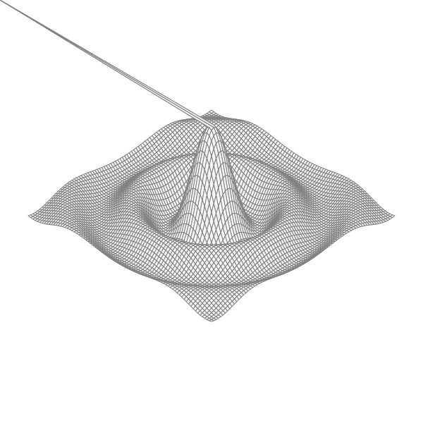

# Isometric view of a function z=f(x,y)

This example is inspired from the example ch3/surface of the book "The Go
Programing Language" from Donovan and Ritchie. See source code at:

* <https://github.com/adonovan/gopl.io>

The execution create this kind of figure:

Try to change the function $z=f(x,y)$.
