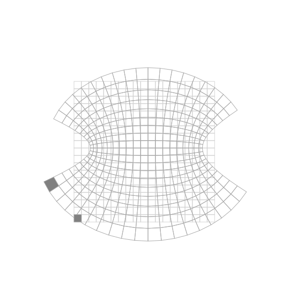
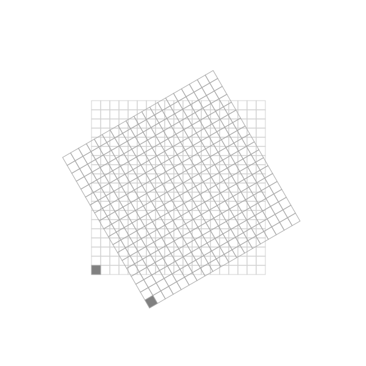

# Représentation graphique d'une fonction complexe holomorphe

Une fonction complexe est une fonction $Z=f(z)$ où $z$ et $Z$ sont des nombres
complexes. A ce titre, on peut les écrire $z=x+iy$ et $Z=X+iY$. On peut
également écrire la fonction $f$ comme la combinaison linéaire de deux fonctions
réelles $u(x,y)$ et $v(x,y)$:

$$
f(z) = f(x+iy) = u(x,y) + i v(x,y)
$$

Une fonction complexe $f(z)$ est dite
[holomorphe](https://fr.wikipedia.org/wiki/Fonction_holomorphe) sur un domaine
$D$ de $\mathbb{C}$, si elle est continue et dérivable sur ce domaine. 

> Attention la notion de dérivation est plus forte dans le plan complexe que
> dans l'espace des réels. De manière analogue aux fonctions réelles, la dérivée
> de $f(z)$ en un point $z_0$ s'exprime comme la limite du taux de variation de
> la fonction quand $z$ tend vers $z_0$, et cette limite doit être la même
> quelque soit le chemin d'approche (la manière avec laquelle $z$ s'approche de
> $z_0$). On peut montrer que cette exigence implique des relations spécifiques
> entre les dérivées des fonctions $u(x,y)$ et $v(x,y)$ (voir les [relations de
> Cauchy-Riemann](https://fr.wikipedia.org/wiki/Fonction_holomorphe)).

Dans la cas où la fonction $f(z)$ est holomorphe, alors elle exprime une
transformation de $z$ vers $Z$ suffisemment douce et continue pour qu'on puisse
en donner une représentation graphique. La notion de "douceur continue" signifie
ici que deux points $z_1$ et $z_2$ proches auront des images $Z_1$ et $Z_2$
proches.

L'idée de la représentation graphique est de prendre un ensemble de points
source $z_{i,j}$ disposés sur les noeuds ${i,j}$ d'une grille régulière du plan complexe
$\mathbb{C}$ et de calculer puis représenter la grille formée par les images
$Z_{i,j} = f(z_{i,j})$. Par exemple, la première figure ci-dessous représente
l'image de la fonction $sin(z)$:

Et celle-ci est l'image de la fonction rotation de 30° (multiplication par
$e^{i\theta}$):

C'est la propriété holomorphe qui permet d'assurer qu'une cellule de la grille
source, c'est-à-dire un quadrangle formé par quatre noeuds adjacents $z_{i,j}$,
$z_{i+1,j}$, $z_{i+1,j+1}$ et $z_{i,j+1}$, a pour image une cellule isomorphe
faite des noeuds $Z_{i,j}$, $Z_{i+1,j}$, $Z_{i+1,j+1}$ et $Z_{i,j+1}$, points
images des noeuds source. Autrement dit, la grille image est une déformation
continue (sans coupure ni déchirure) de la grille source, et cette image de la
déformation est une représentation graphique de la fonction $f(z)$.

C'est ce qu'on propose de montrer dans cet exemple, en produisant l'image svg de
la grille image par une fonction $f$.

> A noter qu'il existe d'autres moyens de représenter une fonction complexe, par
> exemple en donnant une représentation isométrique des fonctions réelles
> $u(x,y)$ et $v(x,y)$. On peut facilement exploiter l'exemple
> [d02.isometry](../d02.isometry) pour mettre au point ce mode de
> représentation.